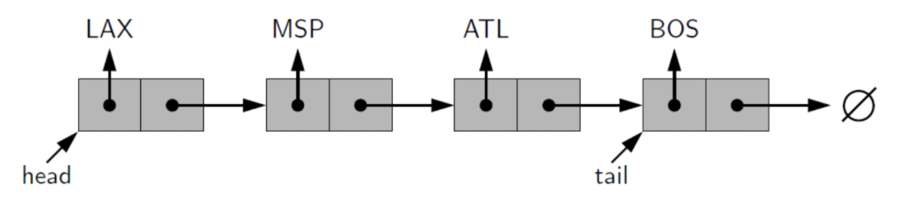
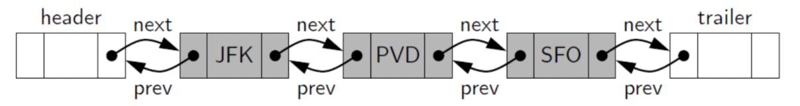

## Recursion (Dynamic Programming)
Following is an example of how to use *recursion* to solve the factorial problem.


# Python Items

## Big O 
- [cheat Sheet](https://www.bigocheatsheet.com/)

## Math
- module, `12 % 7 = 5`.
- division, `12 // 7 = 1`;   `12 / 7 = 1.714...`.

## String
- startswith("xx"), e.g., 
```
str = "this is string example....wow!!!
print(str.startswith( 'this' ))
==> True
```


## set
- Set items are unordered, unchangeable, and do not allow duplicate values.
  
- It is a good tool to check duplicate.

## list
- remove elements:
  
- sort a list: `a = [1,2,1]`, then `a.sort()` --> `a = [1,1,2]`.
  
- slice: reverse a list, `lst[::-1]`;

- pop(index), the default value is -1.

- insert() method inserts an element to the list at the specified index.`list.insert(i, elem)`
e.g.,  `# vowel = ['a', 'e', 'i', 'u'], vowel.insert(3, 'o') >> ['a', 'e', 'i', 'o', 'u']`

- **Attention**, when creating list of class objects, `out = [class] * 4` will make copy of class and will
be overrupted all the values at the same time. Using `out = [class for i in range(4)]` instead. See Q2


## String
- The **replace()** method replaces a specified phrase with another specified phrase. 
  `e.g., s="she is a mother",  s.replace(" ", "") >> "sheisamother"`

- The lower() method returns a string where all characters are lower case.
    'e.g., s="She is A Mother",  s.lower() >> "she is a mother"'


# Linked Lists (Fast Slow Pointers)

## Singly Linked Lists


## Doubly Linked Lists



# Stack and Queue
- **Stack**: last in and first out (LIFO).
- **Queue**: First in and First out. (FIFO)
- **Deque**: New items can be added at either the front or the end.


# Useful functions
- check the type of variables: `isinstance(x, int)`.
  
- **bin()**: returns the binary string equivalent to the given integer. `e.g., bin(number) >> 0b101`, where
`ob`  represents that the result is a binary string.
  
- The **count()** method returns the number of elements with the specified value. `e.g., list.count(value)`, where 
The value can be any type (string, number, list, tuple, etc.). `e.g., a = '1231', a.count('1') >> 2` 

- The **sorted()** function returns a sorted list of the specified iterable object. `e.g., sorted("acad") >> "aacd"`

  